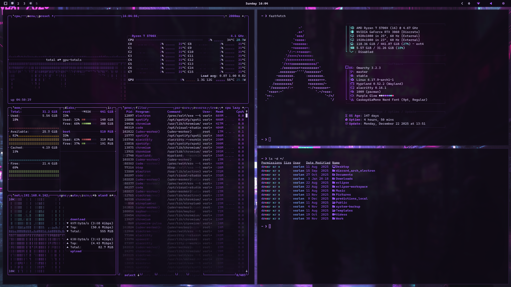

# Purple Glow Theme

A vibrant neon-noir aesthetic for Omarchy. Built on a foundation of deep amethyst and obsidian, illuminated by electric lilac, radiant purple, and soft lavender glows.



---

## Design Notes
- **Atmospheric Depth**: Uses `#0e0914` (Deep Violet Black) for a specialized dark-mode experience.
- **Vibrant Accents**: High-energy highlights using Electric Lilac and Neon Violet.
- **Cool Contrast**: Subtle Aqua and Soft Electric Blue notes to balance the warmth of the purples.
- **Visual Clarity**: Carefully tuned terminal colors for high legibility in development environments.

---

## Color DNA

### Core Shades
| Purpose     | Hex       | Name                   |
|-------------|-----------|------------------------|
| Background  | `#0e0914` | Deep Violet Black       |
| Foreground  | `#e2d9ff` | Soft Lavender Glow      |
| Cursor      | `#c084fc` | Electric Lilac Beam     |

### Accents
| Role     | Hex       | Description              |
|----------|-----------|--------------------------|
| Primary  | `#9b5bff` | Neon Violet               |
| Secondary| `#b659ff` | Radiant Purple            |
| Success  | `#7efff5` | Aqua Glow                 |
| Blue/Alt | `#7b9eff` | Soft Electric Blue        |
| Error    | `#ff4c9e` | Magenta Signal            |

---

## Terminal Palette

| Color    | Normal    | Bright    |
|----------|-----------|-----------|
| Black    | `#191226` | `#241833` |
| Red      | `#ff4c9e` | `#ff79c6` |
| Green    | `#7efff5` | `#94fff7` |
| Yellow   | `#7b9eff` | `#ffe990` |
| Blue     | `#9b5bff` | `#b084ff` |
| Magenta  | `#b659ff` | `#d5a6ff` |
| Cyan     | `#c084fc` | `#a5bfff` |
| White    | `#e2d9ff` | `#ffffff` |

---

## What’s Themed
- **Alacritty** — Deep violet backdrop with electric lilac cursor.
- **Ghostty** Deep violet backdrop with electric lilac cursor.
- **Btop** — Custom gradients shifting from deep violet to magenta.
- **Hyprland** — Violet to radiant purple active borders.
- **Waybar** — Lavender indicators with neon purple highlights.
- **Neovim** — Syntax highlighting mapped to the Purple Glow terminal palette.
- **Vencord** — Full Discord CSS theme for a unified experience.
- **VS Code** - Implements the Darky Purple Theme.

---

## Install
To install this theme, use the Omarchy menu or the command line:

```bash
omarchy-theme-install https://github.com/Quantam-Studios/omarchy-purple-glow-theme
```

Run this command to make the themed fastfetch permanent:

```bash
echo "alias fastfetch='fastfetch --config ~/.config/omarchy/themes/purple-glow/fastfetch.jsonc'" >> ~/${SHELL##*/}rc && source ~/${SHELL##*/}rc
```

---

## Wallpaper Ideas
- **Synthwave Grids**: Purple horizons and neon suns.
- **Macro Crystals**: Amethyst or quartz with backlighting.
- **Cyberpunk Streets**: Rainy alleys with magenta and violet neon signs.
- **Nebulas**: Deep space photography featuring violet gas clouds.

---

**Tip:** The Btop theme uses a unique temperature gradient that shifts from Amethyst to Magenta Signal (`#ff4c9e`) for high-visibility thermal monitoring.
